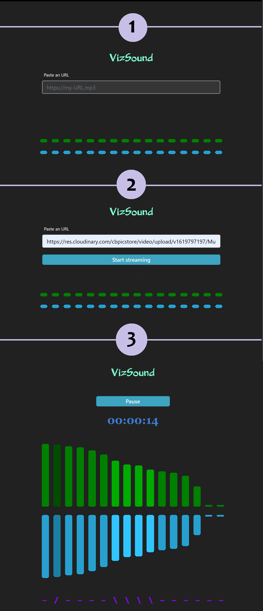

# VizSound

This project was generated with [Angular CLI](https://github.com/angular/angular-cli) version 10.0.5.

## About (temporary)

This is sort of a demo project, mostly to show how I use Observables to handle events and incoming datas that have to be shown in a real time dynamic graph.

In order to mock an API I decided to get some mp3 live streaming and use the Web Audio API to generate changing datas : I just needed to programaticaly call the `getByteFrequencyData()` method of an AnalyserNode created in an instance of AudioContext to simulate the arrival of new datas from a stream.

I choose not to use a <canvas> element to draw the graphics repeatedly and prefered to manage everything with my Angular template because it was more related to my subject – that way each bar is really evolving according to the value received when it occurs, not "blindly" recreated with all the others while an update function loops – and I also thought it was a funny practice...

To be continued (both README and project)

